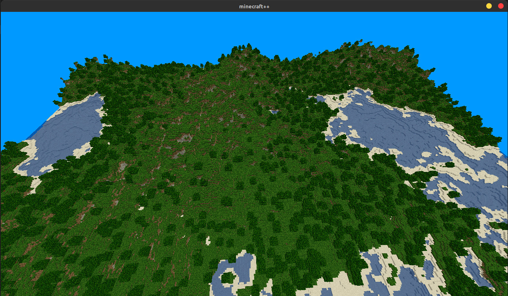
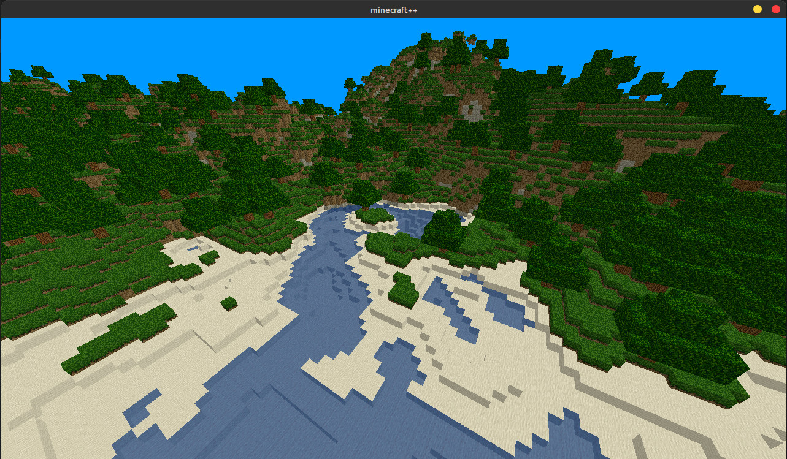
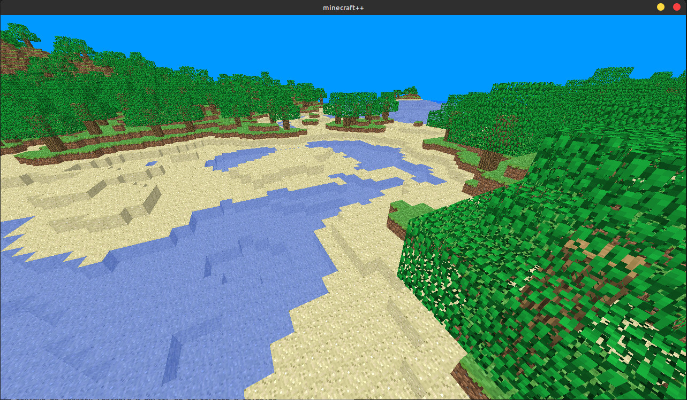
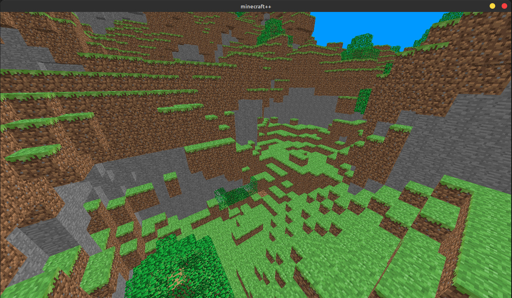

# Minecraft C++

A minecraft clone created using C++ and OpenGL

# bibliothèques:
- SDL2 
- stb_image
- opengl
- glm
- Sebastien Rombauts's SimplexNoise implementation
  
## Screenshoots

## Todo

- add physics
- rework the multithreading system